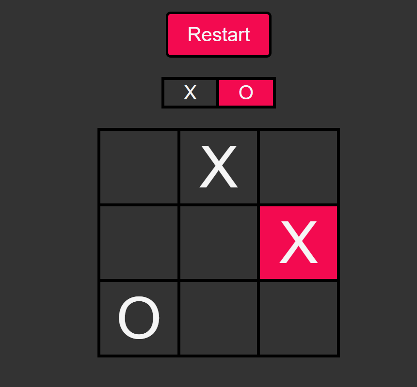

# Browser Tic Tac Toe Game

Hello. Nice to have you here. This is a web application made with React and javascript that features a tic tac toe game for you to play. I made this to test and improve my developing skills. <br>
You can either build and run the application on your local machine or visit the online app [here](https://react-tic-tac-toe-a6a1.onrender.com).
If you wanna run the application locally on your own machine, you can follow the instructions below.

## Running on local machine
### Dependencies
In order to build and run the project in your machine, you’re gonna need to download and install some dependencies first, such as React and Vite. You can use a package manager to do it for you. I recommend using npm. You can download [npm here](https://nodejs.org/en/download/package-manager). You can run the command ```npm -v```
 on your terminal to see if npm was successfully installed.
 If you see a message showing the software version then you’re good to go. <br />
 To install all dependencies required you’re gonna have to open the terminal on the project's root directory and run the following command: ```npm install```. After a few seconds all dependencies should be installed. You can see that a new directory called ```node_modules``` was created for you. All dependencies are located there.

 ### Running the project
 Now everything is set to run the program. To run the project you can type the following command ```npm run dev```. You should see a message on your terminal informing the correct path to access like ```http://localhost:5173```. Just paste this on any web browser of your choice and you’ll see the app running on your screen.




